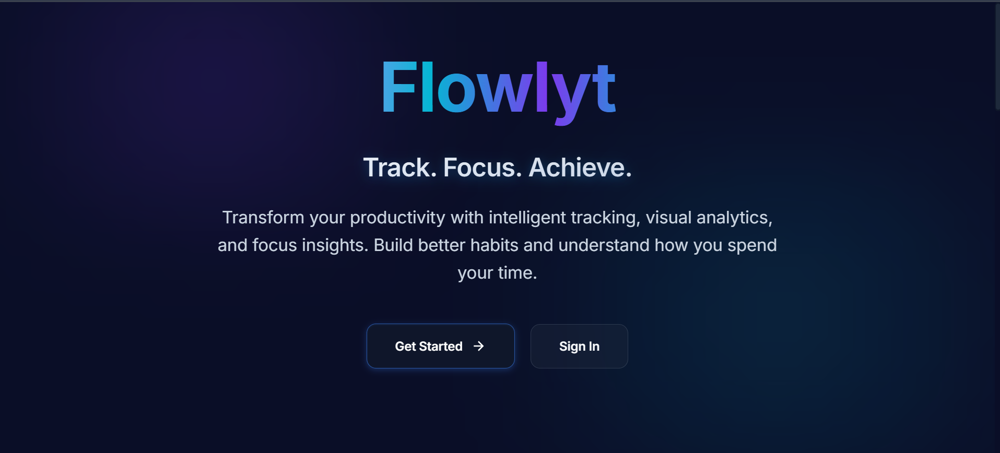
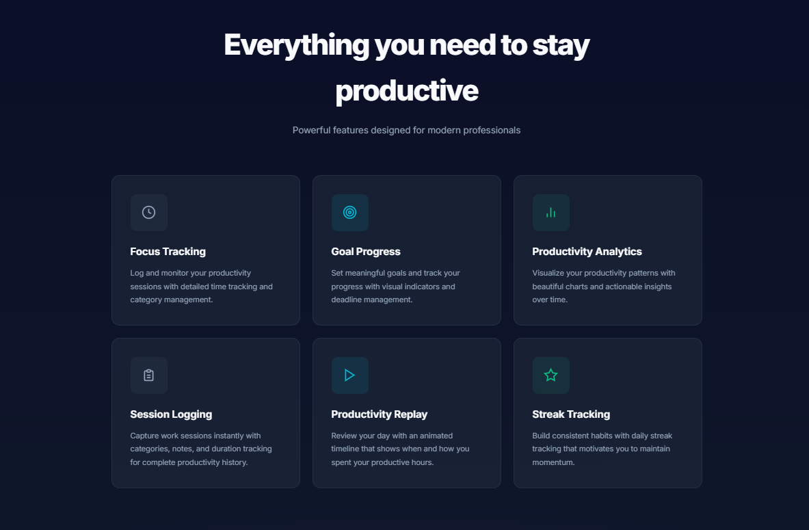
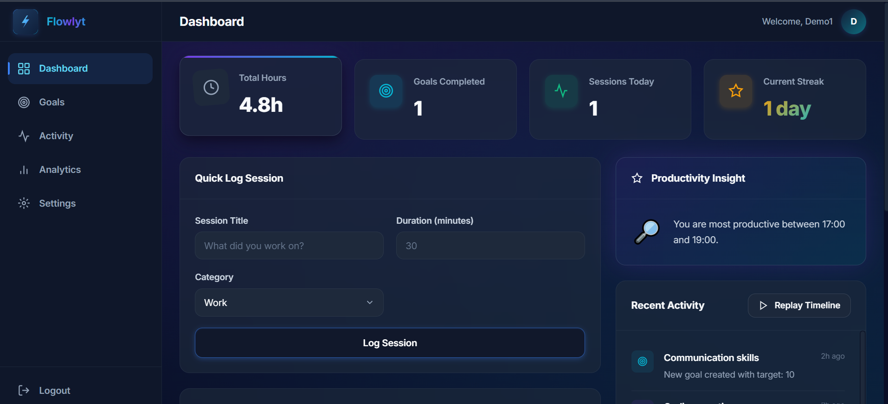
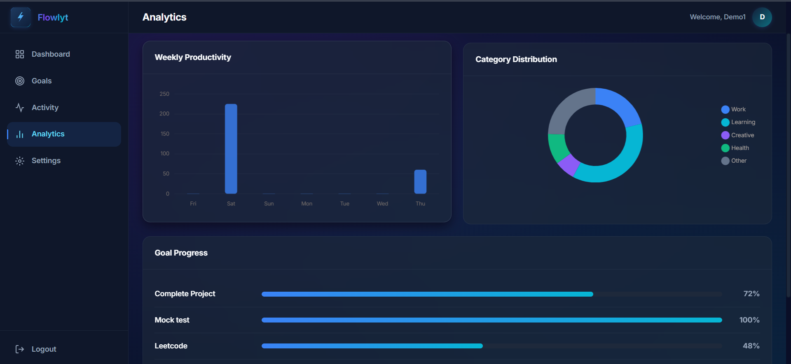
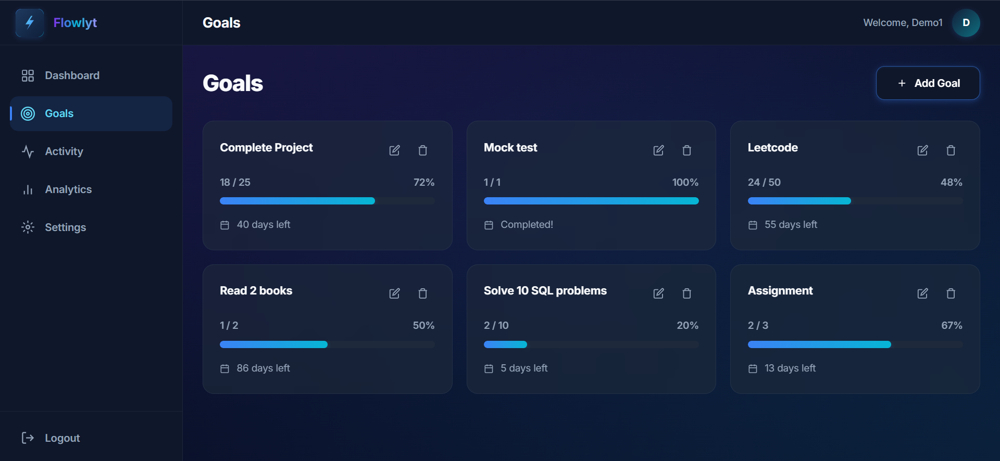
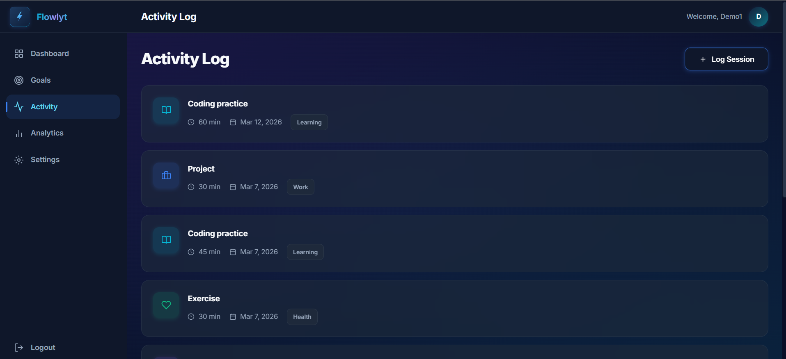

# Flowlyt

  

Flowlyt is a personal productivity intelligence application that helps users track focus sessions, manage goals, and understand how their time is spent.

Instead of just logging time, the application provides visual insights and progress tracking so users can see patterns in their productivity and stay consistent with their goals.

  <a href="https://flowlyt.vercel.app"><strong>Live Demo</strong></a>

---

## Screenshots

### Features

### Dashboard

### Analytics

### Goals

### Activity Log

---

## Feature Overview

|           Feature         |                      Description                            |
|---------------------------|-------------------------------------------------------------|
| Focus Session Logging     | Log productivity sessions with title, duration and category |
| Dashboard Overview        | View total hours, sessions, goals completed and streak      |
| Goal Tracking             | Track productivity goals with visual progress               |
| Analytics                 | Weekly productivity and category charts                     |
| Activity Log              | Timeline view of previous sessions                          |
| Category Tracking         | Organize sessions into categories                           |
| Streak Tracking           | Maintain daily productivity streaks                         |
| Responsive UI             | Works across multiple screen sizes                          |

---

## Tech Stack

Frontend  
- Next.js  
- React  
- TypeScript  

Styling  
- Tailwind CSS  
- shadcn/ui  

Charts  
- Chart.js  

Storage  
- LocalStorage  

Deployment  
- Vercel

---

## Project Structure

flowlyt  
├── app  
├── components  
├── public  
├── styles  
├── assets  
│ ├── landing-hero.png  
│ ├── landing-features.png  
│ ├── dashboard.png  
│ ├── analytics.png  
│ ├── goals.png  
│ └── activity.png  
├── package.json  
├── next.config.mjs  
└── README.md  

---

## Running the Project Locally

Clone the repository

git clone https://github.com/Keerthana-1706/flowlyt.git

Install dependencies

Run development server

Open

http://localhost:3000

---

## Author

Keerthana  

GitHub  
https://github.com/Keerthana-1706

